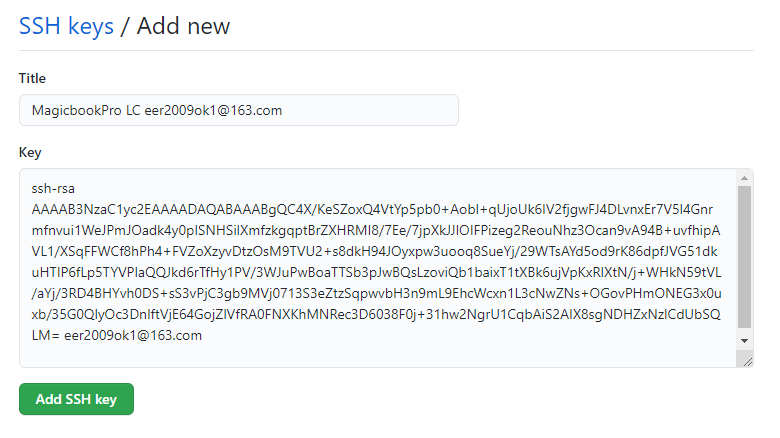
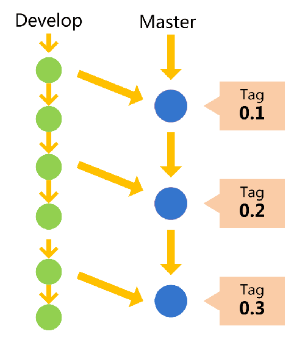

[TOC]

# 安装Git

## 用户信息

安装完成后，还需要最后一步设置，在命令行输入：
```bash
$ git config --global user.name "Your Name"
$ git config --global user.email "email@example.com"
```
因为Git是分布式版本控制系统，所以，每个机器都必须自报家门：你的名字和Email地址。

- `/etc/gitconfig`文件：系统中对所有用户都普遍适用的配置。若使用`git config`时用`--system`选项，读写的就是这个文件。
- `~/.gitconfig`文件：用户目录下的配置文件只适用于该用户。若使用`git config`时用`--global`选项，读写的就是这个文件。
- 当前项目的Git目录中的配置文件（也就是工作目录中的 .git/config 文件）：这里的配置仅仅针对当前项目有效。
- 每一个级别的配置都会覆盖上层的相同配置，所以`.git/config` 里的配置会覆盖`/etc/gitconfig`中的同名变量。

## 文本编辑器
设置Git默认使用的文本编辑器, 一般可能会是 Vi 或者 Vim。如果你有其他偏好，比如 Emacs 的话，可以重新设置：
```bash
$ git config --global core.editor emacs
```

## 差异分析工具
设置Git在解决合并冲突时使用哪种差异分析工具。比如要改用 vimdiff 的话：
```bash
$ git config --global merge.tool vimdiff
```

## 查看配置信息
```bash
#显示当前的 git 配置信息
$ git config --list
#编辑 git 配置文件:
$ git config -e    # 针对当前仓库 
$ git config -e --global   # 针对系统上所有仓库
```
有时候会看到重复的变量名，那就说明它们来自不同的配置文件（比如 /etc/gitconfig 和 ~/.gitconfig），不过最终 Git 实际采用的是最后一个。

# Git工作流程


- Workspace：工作区
- Index / Stage：暂存区（一般存放在 .git 目录下的 index 文件）
- Repository：仓库区（或本地仓库，工作区有一个隐藏目录 .git，可以用 ls -a 命令查看：）
- Remote：远程仓库

# Git基本操作

## 创建仓库

### git init
```bash
#使用当前目录作为 Git 仓库，我们只需使它初始化
$ git init
#使用指定目录作为Git仓库
$ git init [project-name]
```

### git clone

```bash
#拷贝一个Git仓库到本地
$ git clone [url]
#如果你想要一个不一样的名字， 你可以在该命令后加上你想要的名称。
$ git clone [url] [project-name]
```

**注： 在 Linux 系统中，commit 信息使用单引号 '，Windows 系统，commit 信息使用双引号 "。**

## 提交与修改

### git add

```bash
$ git add [file1] [file2] ... #添加一个或多个文件到暂存区
$ git add [dir] #添加指定目录到暂存区，包括子目录
$ git add . #添加当前目录下的所有文件到暂存区
$ git add -p # 添加每个变化前，都会要求确认 # 对于同一个文件的多处变化，可以实现分次提交
```

### git status

```bash
$ git status #查看项目的当前状态
$ git status -s #使用-s参数来获得简短的输出结果
```

### git diff

```bash
$ git diff #尚未缓存的改动
$ git diff --cached #查看已缓存的改动
$ git diff HEAD #查看已缓存的与未缓存的所有改动
$ git diff --stat #显示摘要而非整个 diff

$ git diff [file] #显示暂存区和工作区的差异
$ git diff --cached [file] #显示暂存区和上一次提交(commit)的差异
$ git diff --staged [file] #同上
$ git diff [first-branch]...[second-branch] #显示两次提交之间的差异
```

### git commit

```bash
$ git commit -m [message] #提交暂存区到本地仓库中
$ git commit [file1] [file2] ... -m [message] #提交暂存区的指定文件到仓库区
$ git commit -a #-a参数设置修改文件后不需要执行 git add 命令，直接来提交
$ git commit -v #提交时显示所有diff信息
#使用一次新的commit，替代上一次提交 
#如果代码没有任何新变化，则用来改写上一次commit的提交信息
$ git commit --amend -m [message] 
#重做上一次commit，并包括指定文件的新变化
$ git commit --amend [file1] [file2] ...
```

### git reset

```bash
#git reset 命令语法格式
$ git reset [--soft | --mixed | --hard] [HEAD]

#--mixed 为默认，可以不用带该参数
#用于重置暂存区的文件与上一次的提交(commit)保持一致，工作区文件内容保持不变。
$ git reset  [HEAD] 
$ git reset HEAD^            # 回退所有内容到上一个版本  
$ git reset HEAD^ hello.php  # 回退 hello.php 文件的版本到上一个版本  
$ git reset  052e           # 回退到指定版本

#--soft 参数用于回退到某个版本
$ git reset --soft [HEAD]
$ git reset --soft HEAD~3   # 回退上上上一个版本 

#--hard 参数撤销工作区中所有未提交的修改内容，将暂存区与工作区都回到上一次版本，并删除之前的所有信息提交：
$ git reset --hard [HEAD]  # 可以在版本的历史之间穿梭
$ git reset --hard HEAD~3  # 回退上上上一个版本  
$ git reset --hard bae128  # 回退到某个版本回退点之前的所有信息。 
$ git reset --hard origin/master    # 将本地的状态回退到和远程的一样 

# HEAD 说明：HEAD 表示当前版本、HEAD^ 上一个版本、HEAD^^ 上上一个版本，以此类推...
# HEAD 说明：HEAD~0 表示当前版本、HEAD~1 上一个版本、HEAD^2 上上一个版本，以此类推...
```

### git rm

```bash
#将文件从暂存区和工作区中删除
$ git rm <file>
#强行从暂存区和工作区中删除修改后的 runoob.txt 文件
$ git rm -f <file>
#把文件从暂存区域移除，但文件会保留在工作区
$ git rm --cached <file>
#删除当前目录下的所有文件和子目录
$ git rm –r * 
```

### git mv

```bash
#移动或重命名一个文件、目录或软连接
git mv [file] [newfile]
#如果新文件名已经存在，但还是要重命名它，可以使用 -f 参数
git mv -f [file] [newfile]
```

## 提交日志

### git log

```bash
#查看历史提交记录
$ git log
# --oneline 查看历史记录的简洁的版本
# --graph 查看拓扑图
# --reverse 逆向显示所有日志
# --author 查找指定用户的提交日志
# 指定日期：--since 和 --before，也可以用 --until 和 --after。
# --no-merges 选项以隐藏合并提交
$ git log --oneline --before={3.weeks.ago} --after={2010-04-18} --no-merges
```

### git reflog

```bash
$ git reflog # 显示当前分支的最近几次提交
```

### git blame

```bash
$ git blame <file> #以列表形式查看指定文件的历史修改记录
```

## 远程操作

### git remote

```bash
$ git remote -v #显示所有远程仓库
$ git remote show [remote] #显示某个远程仓库的信息
$ git remote add [shortname] [url] #添加远程版本库
$ git remote rm name  # 删除远程仓库
$ git remote rename old_name new_name  # 修改仓库名
```

### git fetch

```bash
# 将服务器上的更新合并到当前分支
$ git fetch <origin> #提取更新的数据
$ git merge <origin>/<branch> #合并
```

### git pull

```bash
#从远程获取代码并合并本地的版本
$ git pull <远程主机名> <远程分支名>:<本地分支名>
#如果远程分支是与当前分支合并，则冒号后面的部分可以省略
$ git pull <origin> master
```

### git push

```bash
#将本地的分支版本上传到远程并合并
$ git push <远程主机名> <本地分支名>:<远程分支名>
#如果本地分支名与远程分支名相同，则可以省略冒号
$ git push <远程主机名> <本地分支名>
#如果本地版本与远程版本有差异，但又要强制推送可以使用 --force 参数
$ git push --force <origin> master
# 推送所有分支到远程仓库
$ git push <origin> --all
#删除主机的分支可以使用 --delete 参数
$ git push <origin> --delete master
```

## 分支管理

```bash
$ git branch  #列出所有分支
$ git branch -r  # 列出所有远程分支
$ git branch -a  # 列出所有本地分支和远程分支

$ git branch <branchname>  #创建分支
$ git checkout <branchname>  #切换分支
$ git switch <branchname>  #切换分支
$ git checkout - #切换到上一个分支
$ git checkout -b <branchname>  #创建+切换分支
$ git switch -c <branchname>  #创建+切换分支

$ git merge <branchname>  #合并某分支到当前分支
$ git cherry-pick [commit]  #选择一个commit，合并进当前分支

$ git branch -d <branchname>  #删除分支
$ git push origin --delete [branch-name]  #删除远程分支
$ git branch -dr [remote/branch]  #删除远程分支

# 建立追踪关系，在现有分支与指定的远程分支之间
$ git branch --set-upstream [branch] [remote-branch]
```

## git 标签

```bash
$ git tag <tagname>  #新建一个标签，默认为HEAD，也可以指定一个commit id
$ git tag <tagname> <commit>  # 新建一个tag在指定commit
$ git checkout -b [branch] [tag] # 新建一个分支，指向某个tag
$ git tag -a <tagname> -m "blablabla..."  #可以指定标签信息
$ git show <tagname>  #查看标签信息
$ git tag  #查看所有标签
$ git push <origin> <tagname>  #推送一个本地标签
$ git push <origin> --tags  #推送全部未推送过的本地标签
$ git tag -d <tagname>  #删除一个本地标签
$ git push origin :refs/tags/<tagname>  #删除一个远程标签(删除远程标签前先删除本地标签)
```

## 撤销修改

```bash
$ git checkout <file>    # 恢复暂存区的指定文件到工作区
$ git checkout -- <file>   # 丢弃工作区的修改
$ git checkout <commit> <file>   # 恢复某个commit的指定文件到暂存区和工作区
$ git checkout .     # 恢复暂存区的所有文件到工作区

$ git reset <file>     # 重置暂存区的指定文件，与上一次commit保持一致，但工作区不变
$ git reset HEAD <file>    # 恢复暂存区，但工作区不变
$ git checkout HEAD <file>   # Discard local changes in a specific file
$ git reset <commit>    # 重置当前分支的指针为指定commit，同时重置暂存区，但工作区不变

$ git reset --hard     # 重置暂存区与工作区，与上一次commit保持一致
$ git reset --hard	HEAD   # Discard all local changes in your working directory
$ git reset --hard <commit>   # 重置当前分支的HEAD为指定commit，同时重置暂存区和工作区
$ git reset --keep <commit>   # 重置当前HEAD为指定commit，但保持暂存区和工作区不变

# 新建一个commit，用来撤销指定commit
# 后者的所有变化都将被前者抵消，并且应用到当前分支
$ git revert <commit>  

$ git stash       # 把当前工作现场“储藏”起来
$ git stash list     # 查看stash
$ git stash pop      # 恢复的同时删除stash
$ git stash apply      # 恢复，但是恢复后，stash内容并不删除
$ git stash drop     # 删除stash
$ git stash apply stash@{0}   # 恢复指定的stash

# 生成一个可供发布的压缩包
$ git archive
```

# 远程仓库

## 第1步：创建SSH Key。
在用户主目录`C:\Users\LC`下，看看有没有.ssh目录,如果没有创建SSH Key，一路回车，使用默认值即可，由于这个Key也不是用于军事目的，所以也无需设置密码。

```bash
$ ssh-keygen -t rsa -C "youremail@example.com"
$ ssh-keygen -t rsa -f "filename"                 # 创建多个ssh key可以加filename区分，不加会覆盖默认的id_rsa.pub文件
```

如果一切顺利的话，可以在用户主目录里找到.ssh目录，里面有id_rsa和id_rsa.pub两个文件，这两个就是SSH Key的秘钥对，id_rsa是私钥，不能泄露出去，id_rsa.pub是公钥，可以放心地告诉任何人。

## 第2步：登陆GitHub，打开“Settings”，“SSH Keys”页面：



## 添加远程库
- 首先，登陆GitHub，然后，在右上角找到“Create a new repo”按钮，创建一个新的仓库


- 我们根据GitHub的提示，在本地的仓库下运行命令：

```bash
git remote add origin https://github.com/Liang-XiaoSheng/learning.git
```
- 下一步，就可以把本地库的所有内容推送到远程库上：

```bash
git push -u origin master
```
- 把本地库的内容推送到远程，用`git push`命令，实际上是把当前分支master推送到远程。
- 由于远程库是空的，我们第一次推送master分支时，加上了`-u`参数，Git不但会把本地的master分支内容推送到远程新的master分支，还会把本地的master分支和远程的master分支关联起来，在以后的推送或者拉取时就可以简化命令。
- 从现在起，只要本地作了提交，就可以通过命令：
```bash
$ git push origin master
```
把本地master分支的最新修改推送至GitHub，现在，你就拥有了真正的分布式版本库！

## 删除远程库
如果添加的时候地址写错了，或者就是想删除远程库，可以用`git remote rm <name>`命令。使用前，建议先用`git remote -v`查看远程库信息：
```
$ git remote -v
origin  git@github.com:michaelliao/learn-git.git (fetch)
origin  git@github.com:michaelliao/learn-git.git (push)
```
然后，根据名字删除，比如删除origin：
```
$ git remote rm origin
```
此处的“删除”其实是解除了本地和远程的绑定关系，并不是物理上删除了远程库。远程库本身并没有任何改动。要真正删除远程库，需要登录到GitHub，在后台页面找到删除按钮再删除。

## 从远程库克隆
- 要克隆一个仓库，首先必须知道仓库的地址，然后使用git clone命令克隆。
- Git支持多种协议，包括https，但ssh协议速度最快。


# 分支管理策略


## 主分支Master

首先，代码库应该有一个、且仅有一个主分支。所有提供给用户使用的正式版本，都在这个主分支上发布。


- Git主分支的名字，默认叫做Master。
- 它是自动建立的，版本库初始化以后，默认就是在主分支在进行开发。

## 开发分支Develop
主分支只用来分布重大版本，日常开发应该在另一条分支上完成。我们把开发用的分支，叫做Develop。



- 这个分支可以用来生成代码的最新隔夜版本（nightly）。

- 如果想正式对外发布，就在Master分支上，对Develop分支进行"合并"（merge）。

```bash
#Git创建Develop分支的命令：
$ git checkout -b develop master

#将Develop分支发布到Master分支的命令：
$ git checkout master # 切换到Master分支
$ git merge --no-ff -m "bala bala" develop # 对Develop分支进行合并
```

- 默认情况下，Git执行"快进式合并"（fast-farward merge），会直接将Master分支指向Develop分支，这种模式下，删除分支后，会丢掉分支信息。
- 使用**--no-ff**参数（表示禁用Fast forward）后，会执行正常合并，在Master分支上生成一个新节点。
- 为了保证版本演进的清晰，我们希望采用这种做法。


## 临时性分支

前面讲到版本库的两条主要分支：Master和Develop。前者用于正式发布，后者用于日常开发。其实，常设分支只需要这两条就够了，不需要其他了。

但是，除了常设分支以外，还有一些临时性分支，用于应对一些特定目的的版本开发。临时性分支主要有三种：

　　* 功能（feature）分支
　　* 预发布（release）分支
  * 修补bug（fixbug）分支

这三种分支都属于临时性需要，使用完以后，应该删除，使得代码库的常设分支始终只有Master和Develop。

### 功能分支

第一种是功能分支，它是为了开发某种特定功能，从Develop分支上面分出来的。开发完成后，要再并入Develop。


功能分支的名字，可以采用feature-*的形式命名。

```bash
#创建一个功能分支
$ git checkout -b feature-x develop

#开发完成后，将功能分支合并到develop分支
$ git checkout develop
$ git merge --no-ff feature-x

#删除feature分支
$ git branch -d feature-x
```

### 预发布分支

第二种是预发布分支，它是指发布正式版本之前（即合并到Master分支之前），我们可能需要有一个预发布的版本进行测试。

预发布分支是从Develop分支上面分出来的，预发布结束以后，必须合并进Develop和Master分支。它的命名，可以采用release-*的形式。

```bash
#创建一个预发布分支
$ git checkout -b release-1.2 develop

#确认没有问题后，合并到master分支
$ git checkout master
$ git merge --no-ff release-1.2

# 对合并生成的新节点，做一个标签
$ git tag -a 1.2

#再合并到develop分支
$ git checkout develop
$ git merge --no-ff release-1.2

#最后，删除预发布分支
$ git branch -d release-1.2
```

### 修补bug分支

最后一种是修补bug分支。软件正式发布以后，难免会出现bug。这时就需要创建一个分支，进行bug修补。

修补bug分支是从Master分支上面分出来的。修补结束以后，再合并进Master和Develop分支。它的命名，可以采用fixbug-*的形式。


```bash
#创建一个修补bug分支
$ git checkout -b fixbug-0.1 master

#修补结束后，合并到master分支
$ git checkout master
$ git merge --no-ff fixbug-0.1
$ git tag -a 0.1.1

#再合并到develop分支
$ git checkout develop
$ git merge --no-ff fixbug-0.1
#最后，删除修补bug分支
$ git branch -d fixbug-0.1
```

Git提供了一个`stash`功能，可以把当前工作现场“储藏”起来，等以后恢复现场后继续工作

```bash
$ git stash
Saved working directory and index state WIP on dev: f52c633 add merge
```
现在，是时候接着回到dev分支干活了！工作区是干净的，刚才的工作现场存到哪去了？用`git stash list`命令看看：
```
$ git stash list
stash@{0}: WIP on dev: f52c633 add merge
```
Git把stash内容存在某个地方了，但是需要恢复一下，有两个办法：
- `git stash apply`恢复，但是恢复后，stash内容并不删除，你需要用`git stash drop`来删除；
- `git stash pop`，恢复的同时把stash内容也删了：

再用`git stash list`查看，就看不到任何stash内容了：
```
$ git stash list
```

你可以多次stash，恢复的时候，先用`git stash list`查看，然后恢复指定的stash，用命令：
```
$ git stash apply stash@{0}
```

- 修复bug时，我们会通过创建新的bug分支进行修复，然后合并，最后删除；
- 当手头工作没有完成时，先把工作现场`git stash`一下，然后去修复bug，修复后，再`git stash pop`，回到工作现场；
- 在master分支上修复的bug，想要合并到当前dev分支，可以用`git cherry-pick <commit>`命令，把bug提交的修改“复制”到当前分支，避免重复劳动。

```
$ git cherry-pick 4c805e2
[master 1d4b803] fix bug 101
 1 file changed, 1 insertion(+), 1 deletion(-)
```

# 多人协作

要查看远程库的信息，用`git remote`：
```bash
$ git remote
origin
```

或者，用`git remote -v`显示更详细的信息：
```bash
$ git remote -v
origin  git@github.com:michaelliao/learngit.git (fetch)
origin  git@github.com:michaelliao/learngit.git (push)
```
上面显示了可以抓取和推送的origin的地址。如果没有推送权限，就看不到push的地址。

**多人协作的工作模式通常是这样：**

- 首先，可以试图用`git push origin <branch-name>`推送自己的修改；
- 如果推送失败，则因为远程分支比你的本地更新，需要先用`git pull`试图合并；
- 如果合并有冲突，则解决冲突，并在本地提交；
- 没有冲突或者解决掉冲突后，再用`git push origin <branch-name>`推送就能成功！
- 如果`git pull`提示`no tracking information`，则说明本地分支和远程分支的链接关系没有创建，用命令`git branch --set-upstream-to=origin/branch-name  branch-name`

**小结**

- 在本地创建和远程分支对应的分支，使用`git checkout -b branch-name origin/branch-name`，本地和远程分支的名称最好一致；
- 建立本地分支和远程分支的关联，使用`git branch --set-upstream-to=origin/branch-name  branch-name`

# Rebase
- rebase操作可以把本地未push的分叉提交历史整理成直线；
- rebase的目的是使得我们在查看历史提交的变化时更容易，因为分叉的提交需要三方对比。
```bash
$ git log --graph --pretty=oneline --abbrev-commit
*   e0ea545 (HEAD -> master) Merge branch 'master' of github.com:michaelliao/learngit
|\  
| * f005ed4 (origin/master) set exit=1
* | 582d922 add author
* | 8875536 add comment
|/  
* d1be385 init hello
...

对强迫症童鞋来说，现在事情有点不对头，提交历史分叉了。
这个时候，rebase就派上了用场。我们输入命令git rebase试试：

$ git rebase
First, rewinding head to replay your work on top of it...
Applying: add comment
Using index info to reconstruct a base tree...
M	hello.py
Falling back to patching base and 3-way merge...
Auto-merging hello.py
Applying: add author
Using index info to reconstruct a base tree...
M	hello.py
Falling back to patching base and 3-way merge...
Auto-merging hello.py
输出了一大堆操作，到底是啥效果？再用git log看看：

$ git log --graph --pretty=oneline --abbrev-commit
* 7e61ed4 (HEAD -> master) add author
* 3611cfe add comment
* f005ed4 (origin/master) set exit=1
* d1be385 init hello
...
```

# 自定义Git

让Git显示颜色，会让命令输出看起来更醒目：
```bash
$ git config --global color.ui true
```

# 忽略特殊文件

在Git工作区的根目录下创建一个特殊的`.gitignore`文件，然后把要忽略的文件名填进去，Git就会自动忽略这些文件。

不需要从头写`.gitignore`文件，GitHub已经为我们准备了各种配置文件，只需要组合一下就可以使用了。所有配置文件可以直接在线浏览：https://github.com/github/gitignore

忽略文件的原则是：
- 忽略操作系统自动生成的文件，比如缩略图等；
- 忽略编译生成的中间文件、可执行文件等，也就是如果一个文件是通过另一个文件自动生成的，那自动生成的文件就没必要放进版本库，比如Java编译产生的.class文件；
- 忽略你自己的带有敏感信息的配置文件，比如存放口令的配置文件。

有些时候，你想添加一个文件到Git，但发现添加不了，原因是这个文件被`.gitignore`忽略了：
```bash
$ git add App.class
The following paths are ignored by one of your .gitignore files:
App.class
Use -f if you really want to add them.
```
如果你确实想添加该文件，可以用`-f`强制添加到Git：
```bash
$ git add -f App.class
```
或者你发现，可能是`.gitignore`写得有问题，需要找出来到底哪个规则写错了，可以用`git check-ignore`命令检查：
```bash
$ git check-ignore -v App.class
.gitignore:3:*.class	App.class
```
Git会告诉我们，`.gitignore`的第3行规则忽略了该文件，于是我们就可以知道应该修订哪个规则。

还有些时候，当我们编写了规则排除了部分文件时：
```
# 排除所有.开头的隐藏文件:
.*
# 排除所有.class文件:
*.class
```
但是我们发现`.*`这个规则把`.gitignore`也排除了，并且`App.class`需要被添加到版本库，但是被`*.class`规则排除了。

虽然可以用`git add -f`强制添加进去，但有强迫症的童鞋还是希望不要破坏`.gitignore`规则，这个时候，可以添加两条例外规则：
```
# 排除所有.开头的隐藏文件:
.*
# 排除所有.class文件:
*.class

# 不排除.gitignore和App.class:
!.gitignore
!App.class
```
把指定文件排除在`.gitignore`规则外的写法就是`!`+文件名，所以，只需把例外文件添加进去即可。

- 忽略某些文件时，需要编写`.gitignore`；
- `.gitignore`文件本身要放到版本库里，并且可以对`.gitignore`做版本管理！

### 配置别名

例：
```
$ git config --global alias.st status
$ git config --global alias.co checkout
$ git config --global alias.ci commit
$ git config --global alias.br branch
$ git config --global alias.unstage 'reset HEAD'
$ git config --global alias.lg "log --color --graph --pretty=format:'%Cred%h%Creset -%C(yellow)%d%Creset %s %Cgreen(%cr) %C(bold blue)<%an>%Creset' --abbrev-commit"
```
- 配置Git的时候，加上`--global`是针对当前用户起作用的
- 如果不加，那只针对当前的仓库起作用。
- 每个仓库的Git配置文件都放在`.git/config`文件中：
- 当前用户的Git配置文件放在用户主目录下的一个隐藏文件`.gitconfig`中：

# 搭建Git服务器

搭建Git服务器需要准备一台运行Linux的机器，强烈推荐用Ubuntu或Debian，这样，通过几条简单的apt命令就可以完成安装。

## 1、安装git：
```bash
$ sudo apt-get install git
```

## 2、创建一个git用户，用来运行git服务：
```bash
$ sudo adduser git
```

## 3、创建证书登录：
收集所有需要登录的用户的公钥，就是他们自己的id\_rsa.pub文件，把所有公钥导入到`/home/git/.ssh/authorized_keys`文件里，一行一个。

## 4、初始化Git仓库：
先选定一个目录作为Git仓库，假定是`/srv/sample.git`，在`/srv`目录下输入命令：
```bash
$ sudo git init --bare sample.git
```
Git就会创建一个裸仓库，裸仓库没有工作区，因为服务器上的Git仓库纯粹是为了共享，所以不让用户直接登录到服务器上去改工作区，并且服务器上的Git仓库通常都以.git结尾。然后，把owner改为git：
```bash
$ sudo chown -R git:git sample.git
```

## 5、禁用shell登录：
出于安全考虑，第二步创建的git用户不允许登录shell，这可以通过编辑`/etc/passwd`文件完成。找到类似下面的一行：
```
git:x:1001:1001:,,,:/home/git:/bin/bash
```
改为：
```
git:x:1001:1001:,,,:/home/git:/usr/bin/git-shell
```
这样，git用户可以正常通过ssh使用git，但无法登录shell，因为我们为git用户指定的git-shell每次一登录就自动退出。

## 6、克隆远程仓库：
现在，可以通过`git clone`命令克隆远程仓库了，在各自的电脑上运行：
```
$ git clone git@server:/srv/sample.git
Cloning into 'sample'...
warning: You appear to have cloned an empty repository.
```
剩下的推送就简单了。

## 管理公钥
如果团队很小，把每个人的公钥收集起来放到服务器的`/home/git/.ssh/authorized_keys`文件里就是可行的。如果团队有几百号人，就没法这么玩了，这时，可以用Gitosis来管理公钥。

## 管理权限
有很多不但视源代码如生命，而且视员工为窃贼的公司，会在版本控制系统里设置一套完善的权限控制，每个人是否有读写权限会精确到每个分支甚至每个目录下。因为Git是为Linux源代码托管而开发的，所以Git也继承了开源社区的精神，不支持权限控制。不过，因为Git支持钩子（hook），所以，可以在服务器端编写一系列脚本来控制提交等操作，达到权限控制的目的。Gitolite就是这个工具。

## 小结
- 搭建Git服务器非常简单，通常10分钟即可完成；
- 要方便管理公钥，用Gitosis；
- 要像SVN那样变态地控制权限，用Gitolite。

# 图形工具

- [SourceTree](https://www.sourcetreeapp.com/)
- [Git Cheat Sheet](https://liaoxuefeng.gitee.io/resource.liaoxuefeng.com/git/git-cheat-sheet.pdf)
- [Git官方网站](http://git-scm.com/)