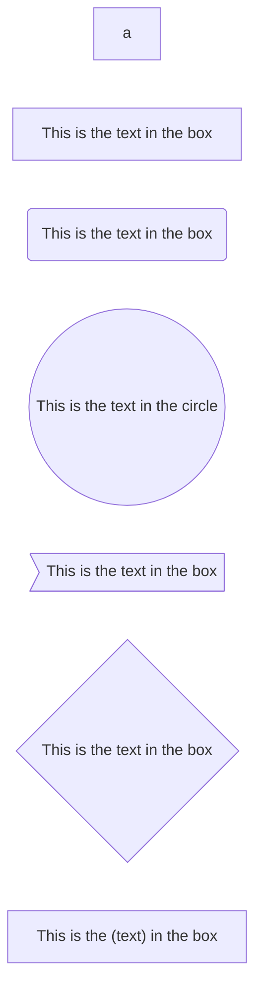
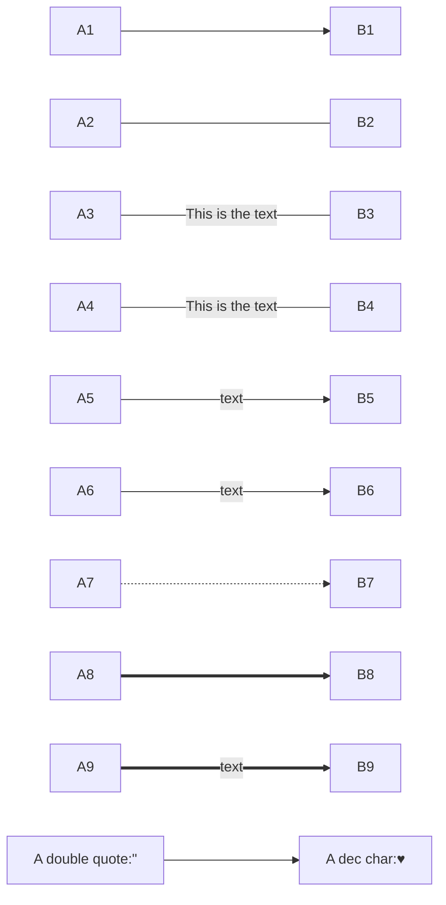
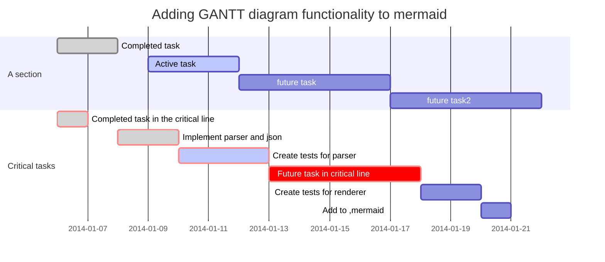
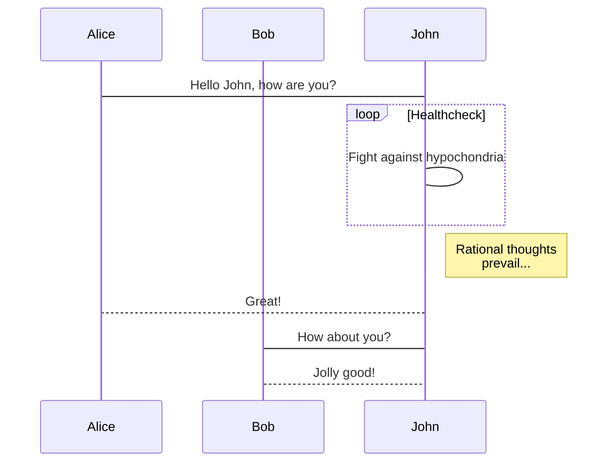
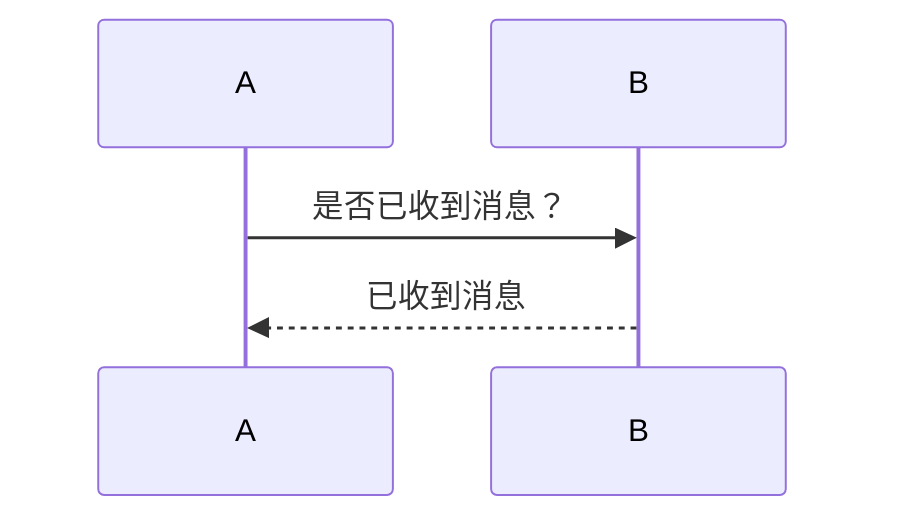

# 一级标题
## 二级标题
### 三级标题
#### 四级标题
##### 五级标题
###### 六级标题

**加粗**
*斜体*
***斜体加粗***
~~删除线~~
++下划线++


一级标题
====
一级标题
=
二级标题
---------------

>引用
>>引用
>>>>>>>>引用

---
***
*************
--------


[百度](www.baidu.com "也一样")
- 刘备
+ 丈夫
* 三店
1. 三店
2. 到付
3. 人
- 一级
  - 二级
     2. 三级
        2. 四级
          - 到付
            7. 顺丰
            8. 
- 色粉

===

ef|re|ds 
:---|---:|:---:
d |f |sdf
drgdrg靠左 |dfgddgdgfgd靠右|dfgdgh居中

`牛B的代码`

```
ew 
wf  ;ef 
  sef ;
  许多行牛B的代码
```










